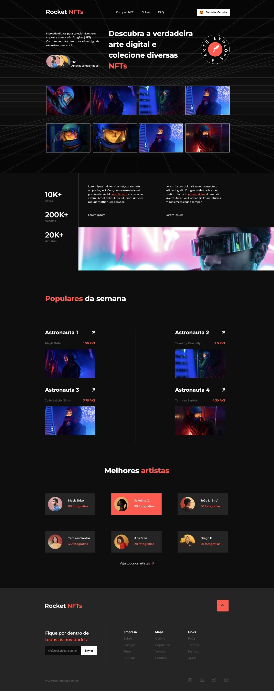

# Desafio: Rocket NFTs



# 💻 Sobre o desafio

Desafio para desenvolver uma landing page completa sobre NFTs.

## Layout

Você pode visualizar o template do projeto clicando [neste link](https://www.figma.com/file/VDRCPVEywzdweh8BGnu0M5/Rocket-NFTs/duplicate)

# 🚀 **Techs**


- HTML
- CSS


# 🎨 Style Guide

## **Cores:**


```css
:root {
  --body-background: #0e0e0e;
  --color-logo: #ff5b50;
  --card-color: #252525;
  --text-color: #fff;
  --subtitle-color: #5a5757;
  --black-text: #000;
  --color-input: #0D0D0D;
}
```

## **Tipo de fonte:**

font-family: Montserrat 

Font Weight: 400, 500, 700

Você pode encontrar a fonte no [Google Fonts](https://fonts.google.com/) 


---
Feito com 💜
